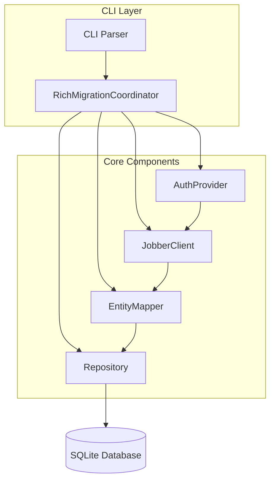

# **Product Requirements Document (PRD) – v0.1 MVP (OO‑focused)**

Last updated: July 14, 2025

---

## 1. Purpose & Goals

**Purpose:**  Build a minimal, end‑to‑end, object‑oriented command‑line tool to fetch core data from Jobber and persist it into a local SQLite database, with clear separation of concerns and adhere to OOP principles.\
**Primary Goals:**

- Verify connectivity to Jobber’s GraphQL API via a dedicated client class.
- Extract two entity types (Clients & Invoices) into model classes.
- Persist records using a repository class interacting with SQLite.
- Provide a CLI coordinator class to orchestrate authentication, fetching, and persistence.
- Ensure each class has a single responsibility and dependencies are injected for testability.

---

## 2. Scope

**In‑Scope (v0.1):**

- Authentication via `JOBBER_TOKEN` environment variable (handled by `AuthProvider`).
- Fetch and persist **Clients** and **Invoices** via `JobberClient`, `EntityMapper`, `Repository`.
- Basic paging through Jobber results until exhausted.
- Console‑only output via `Logger` interface (no dry‑run flags).
- Hard‑coded field mappings inside `EntityMapper`.

**Out‑of‑Scope (v1+):**

- ServiceTitan integration.
- Attachments or binary data.
- Retry/back‑off, idempotency, checkpointing.
- Configurable mappings or metrics.
- Automated tests (manual validation).

---

## 3. Architecture & OOP Design

### 3.1 Core Classes & Responsibilities

- **AuthProvider**
  - Responsibility: Read and validate `JOBBER_TOKEN` from environment.
  - Interface: `get_token() -> str`
- **JobberClient**
  - Responsibility: Perform GraphQL queries to Jobber API.
  - Dependencies: `AuthProvider`, HTTP client.
  - Methods: `fetch_clients(cursor=None)`, `fetch_invoices(cursor=None)`
- **EntityModel** (package)
  - `Client` class with attributes: `id`, `first_name`, `last_name`, `email`, `phone`, `created_at`.
  - `Invoice` class with attributes: `id`, `client_id`, `number`, `total_cents`, `status`, `issued_at`.
- **EntityMapper**
  - Responsibility: Map raw GraphQL payloads into `EntityModel` objects.
  - Methods: `map_client(data) -> Client`, `map_invoice(data) -> Invoice`
- **Repository**
  - Responsibility: Abstract SQLite operations (create tables, upsert entities).
  - Dependencies: DB connection.
  - Methods: `init_schema()`, `save_clients(List[Client])`, `save_invoices(List[Invoice])`
- **RichMigrationCoordinator**
  - Responsibility: Orchestrate the full workflow.
  - Dependencies: `JobberClient`, `EntityMapper`, `Repository`, `Logger`.
  - Method: `migrate()`
- **CLI** (Typer-based)
  - Responsibility: Parse arguments with Typer, instantiate dependencies via dependency injection, and invoke `RichMigrationCoordinator`.
  - Implementation:
    - Use `typer.Typer()` to define the main app and subcommands.
    - Commands:

      ```python
      app = typer.Typer()

      @app.command()
      def migrate(
          db: Path = typer.Option(..., help="Path to SQLite DB"),
          verbose: bool = typer.Option(False, "-v", help="Enable verbose logging")
      ):
          """Fetch Jobber data and persist to SQLite"""
          # Instantiate AuthProvider, JobberClient, etc.
          coordinator = RichMigrationCoordinator(...)
          coordinator.migrate()
      ```

    - Support subcommands via separate `Typer()` instances (e.g., `notes_app = typer.Typer()`).
    - Leverage Typer's automatic type conversion, help messages, and environment variable support (`typer.Option(..., envvar="JOBBER_TOKEN")`).
    - Entry point: `if __name__ == "__main__": app()`
    - Enables easy testing by calling command functions directly.
  - Dependencies: Injected via function parameters or a DI container configured in `cli.py`.

### 3.2 Sequence Flow

1. CLI reads `--db` path and ensures `JOBBER_TOKEN` is set.
2. Instantiate `AuthProvider`, `JobberClient`, `EntityMapper`, `Repository`, `Logger`.
3. `RichMigrationCoordinator.migrate()` calls:
   - `Repository.init_schema()`
   - Loop: `JobberClient.fetch_clients()`, `EntityMapper.map_client()`, `Repository.save_clients()`
   - Loop: `JobberClient.fetch_invoices()`, `EntityMapper.map_invoice()`, `Repository.save_invoices()`
4. Print summary via `Logger`.

---

## 4. Technical Requirements

### 4.1 Authentication

- **AuthProvider**: raise `ConfigurationError` if `JOBBER_TOKEN` missing.

### 4.2 GraphQL Queries

- **Current Patterns:**

  ```python
  # Example from Quotes Export script
  response = requests.post(
      API_URL,
      headers=HEADERS,
      json={"query": query}
  )  # fileciteturn2file0
  data = response.json()
  ```

  ```python
  # Example from Names Validation script
  response = requests.post(
      API_URL,
      headers=HEADERS,
      json={"query": query, "variables": variables}
  )  # fileciteturn2file1
  if response.status_code == 200:
      data = response.json()
  ```

- **Improvement Ideas:**

  - **Centralize HTTP calls** in an `HttpClient` wrapper that handles `post()`, JSON parsing, status checks, and retries with exponential back‑off/jitter.
  - **Use a GraphQL client library** (e.g., `gql`) to construct and execute typed queries, improving clarity and reducing manual JSON handling.
  - **Inject headers** via `AuthProvider` rather than global constants, to facilitate testing and secret‑management integration.
  - **Unify error handling**, raising domain‑specific exceptions instead of printing and breaking loops.

### 4.3 CRUD Interface & Schema Definitions

To build on the scaffolded classes, define a simple CRUD interface for each entity and corresponding SQL schema.

```python
class CrudRepository(Generic[T]):
    def create(self, obj: T) -> None: ...
    def read(self, id: str) -> Optional[T]: ...
    def update(self, obj: T) -> None: ...
    def delete(self, id: str) -> None: ...
```

**SQLite Table Schemas:**

```sql
-- Clients
CREATE TABLE IF NOT EXISTS clients (
  id          TEXT PRIMARY KEY,
  first_name  TEXT,
  last_name   TEXT,
  email       TEXT,
  phone       TEXT,
  created_at  TEXT
);

-- Invoices
CREATE TABLE IF NOT EXISTS invoices (
  id           TEXT PRIMARY KEY,
  client_id    TEXT NOT NULL REFERENCES clients(id),
  number       TEXT,
  total_cents  INTEGER,
  status       TEXT,
  issued_at    TEXT
);
```

**Repository Methods (Examples):**

```python
class ClientRepository(Repository, CrudRepository[Client]):
    def create(self, client: Client):
        self.db.execute(
            "INSERT INTO clients VALUES (?,?,?,?,?,?)",
            (client.id, client.first_name, client.last_name,
             client.email, client.phone, client.created_at)
        )
    def read(self, id: str) -> Optional[Client]:
        row = self.db.query("SELECT * FROM clients WHERE id=?", (id,)).fetchone()
        return Client(*row) if row else None
    # update/delete similarly...
```

- **JobberClient** uses cursor paging, returns raw dicts.
- Queries:

  ```graphql
  query FetchClients($cursor: String) { ... }
  query FetchInvoices($cursor: String) { ... }
  ```

### 4.3 Persistence (Repository)

- Use `sqlite3` module or an ORM wrapper for simple operations.
- Schema as defined: `clients` and `invoices` tables.

---

## 5. Success Criteria

1. **Classes instantiated cleanly**; dependency injection allows for stubbing in tests.
2. Running `fetch-jobber --db ./data.sqlite` populates tables without errors.
3. CLI outputs summary via `Logger.info`.
4. Single Responsibility adhered: each class has one clear purpose.

---

## 6. Timeline & Milestones

| Date    | Deliverable                                      |
| ------- | ------------------------------------------------ |
| July 17 | Implement `AuthProvider`, `JobberClient`, models |
| July 18 | Add `EntityMapper`, `Repository.init_schema()`   |
| July 19 | Complete `RichMigrationCoordinator.migrate()` flow   |
| July 20 | CLI integration, summary output via `Logger`     |
| July 21 | Manual demo and PRD sign‑off                     |

---

## 7. Next Steps

1. Review OOP design and class responsibilities.
2. Branch `mvp‑v0.1‑oo` and scaffold module structure.
3. Begin implementation following timeline above.

---

---

## 8. Data Flow Diagram

Use the diagram below to visualize class interactions and data flow for function planning and implementation.



**Interpretation:**

1. **CLI Parser** instantiates and invokes **RichMigrationCoordinator**.
2. **RichMigrationCoordinator** orchestrates calls to **AuthProvider**, **JobberClient**, **EntityMapper**, and **Repository**.
3. **AuthProvider** supplies the token for **JobberClient**’s GraphQL requests.
4. **JobberClient** fetches raw data and passes it to **EntityMapper**.
5. **EntityMapper** transforms raw payloads into domain objects and hands them to **Repository**.
6. **Repository** performs upserts into the **SQLite** backend.

Use this as a guide for breaking down into individual functions and modules when scaffolding your codebase.

---

## 9. Extended Functionality & Optimization

To reproduce and improve the existing export and count scripts, introduce a plugin-based extractor architecture, a scheduler for automation, and performance enhancements:

### 9.1 Plugin-Based Extractors

- **Extractor Interface**: define `BaseExtractor` with methods `fetch(cursor)->List[RawData]`, `process(raw: RawData)->Model`, and `persist(models: List[Model])`.
- **Plugins**: implement `NotesExtractor`, `QuotesExtractor`, `InvoicesExtractor`, `NamesValidationExtractor` inheriting `BaseExtractor`.
- **Factory**: `ExtractorFactory` returns instances by name for CLI or scheduler to invoke.

### 9.2 Scheduler & Automation

- **Scheduler Service**: implement `Scheduler` class with configurable intervals (e.g., cron expressions) to run extractors automatically without manual intervention.
- **State Persistence**: use a `StateRepository` (backed by SQLite or JSON) to track cursors, last run times, and retry counts instead of flat files.
- **Daemon Mode**: `fetch-jobber --run-daemon` starts a long-lived process that schedules and executes extractors, handling back-off on throttling.

### 9.3 Performance & Reliability

- **Pagination Tuning**: increase `first` parameter (e.g., 100–250) to reduce round trips.
- **Concurrency**: for independent extractors or attachment downloads, use thread or process pools with configurable max workers.
- **Retry Strategy**: centralize HTTP retry logic with exponential back-off, jitter, and max retries in `HttpClient` wrapper.
- **Batch Persistence**: commit database transactions in batches (e.g., 500 records) to reduce I/O.
- **Logging & Metrics**: integrate a pluggable `Logger` and optional metrics emission (e.g., Prometheus) for monitoring.

### 9.4 CLI Enhancements

- **Subcommands**: `fetch-jobber notes`, `fetch-jobber quotes`, `fetch-jobber invoices`, `validate names`, each invoking the corresponding extractor.
- **Global Flags**: `--db`, `--config`, `--dry-run`, `--verbose`.
- **Overrides**: allow per-extractor overrides via config file or CLI args (e.g., page size, worker count).

---

Leverage this extended design to consolidate all current scripts into a unified, performant, and automated codebase. Let me know if you’d like code scaffolding for any of these components!

---

## Appendix: Recommended Documentation

To support development, onboarding, and future maintenance, include links and summaries for the following docs:

1. **Jobber GraphQL API Reference**
   - Endpoint URLs, authentication details, schema introspection guide, rate limits, pagination conventions.
2. **ServiceTitan Sandbox API Docs**
   - (Future) Authentication flows, payload formats, error codes, sandbox limitations.
3. **SQLite3 Python Module**
   - Connection management, parameterized queries, best practices for transactions and concurrency.
4. **Typer Documentation**
   - CLI application patterns, subcommands, dependency injection, environment variable support.
5. **gql (GraphQL Client)**
   - Query building, schema typing, client configuration, retry middleware.
6. **Python Logging Cookbook**
   - Configuring loggers, handlers, formatters, structured logging considerations.
7. **Python **``** & **``** Libraries**
   - Advanced usage, session management, retry strategies, async support (for future work).
8. **Dependency Injection in Python**
   - Libraries like `injector` or `wired`, patterns for constructor vs. function injection.
9. **Design Patterns**
   - Repository, Factory, Strategy, Command, Observer (for scheduler/metrics events).
10. **Mermaid**
    - Syntax guide for diagrams, embedding in Markdown and PRDs.

Include these in your project’s `/docs` directory, with Markdown files or pointers to external URLs, to ensure easy reference and consistent standards across the team.
