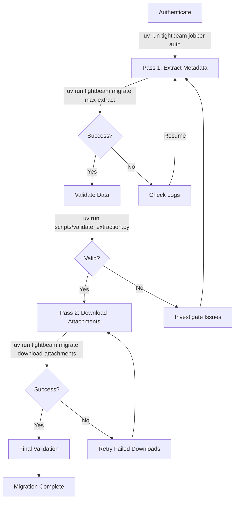

# Max Extract Migration Guide

## Overview

TightBeam's Max Extract feature provides a professional-grade, two-pass extraction system for complete Jobber data migration:

- **Pass 1**: GraphQL metadata extraction with cost-aware pagination
- **Pass 2**: Binary file downloader with hash-based storage

This guide walks you through the complete migration workflow, from setup to verification.

## Prerequisites

### Required

- Valid Jobber OAuth 2.0 credentials
- Python 3.10 or higher
- Sufficient disk space (estimate 2-5 GB for medium-sized accounts)
- Stable internet connection

### Recommended

- Terminal with support for Rich text UI
- SQLite browser (e.g., DB Browser for SQLite) for data inspection
- Familiarity with Jobber's data model

## Quick Start

### Complete Migration (All Entities)

```bash
# Step 1: Authenticate with Jobber
uv run tightbeam jobber auth

# Step 2: Extract all metadata (Pass 1)
uv run tightbeam migrate max-extract --db jobber_export.db

# Step 3: Download attachments (Pass 2)
uv run tightbeam migrate download-attachments --db jobber_export.db --output-dir ./attachments
```

### Selective Migration (Specific Entities)

```bash
# Extract only clients and invoices
uv run tightbeam migrate max-extract \
  --db jobber_export.db \
  --entities clients,invoices,notes
```

## Pass 1: Metadata Extraction

### Overview

Pass 1 extracts all GraphQL-accessible metadata from Jobber and stores it in SQLite. This includes:

- Core business entities (clients, jobs, quotes, invoices, etc.)
- Notes with polymorphic parent references
- Attachment metadata (URLs, file names, sizes)
- User and configuration data

### Command Reference

```bash
uv run tightbeam migrate max-extract [OPTIONS]
```

#### Options

| Option | Type | Default | Description |
|--------|------|---------|-------------|
| `--db` | Path | `jobber_export.db` | SQLite database path |
| `--entities` | List | All entities | Comma-separated entity types to extract |
| `--resume` | Flag | `False` | Resume from last checkpoint |
| `--optimization-level` | Choice | `moderate` | Rate limiting: `conservative`, `moderate`, `aggressive` |
| `--skip-existing` | Flag | `False` | Skip entities already in database |
| `--dry-run` | Flag | `False` | Preview without writing to database |

### Entity Extraction Order

Entities are extracted in dependency order to maintain foreign key integrity:

1. **users** - No dependencies, extracted first
2. **clients** - References users (assigned_user_id)
3. **properties** - References clients
4. **requests** - References clients, properties
5. **quotes** - References clients, properties, visits
6. **jobs** - References clients, properties, visits
7. **visits** - References clients, properties, jobs
8. **invoices** - References clients, jobs
9. **expenses** - References jobs
10. **timesheet_entries** - References users, jobs
11. **product_services** - No dependencies (catalog items)
12. **tax_rates** - No dependencies (configuration)
13. **notes** - References multiple parent types (polymorphic)

### Examples

#### Standard Extraction

```bash
# Extract all entities with default settings
uv run tightbeam migrate max-extract --db my_export.db
```

Expected output:
```
📦 Extracting: users
✓ Completed users: 12 entities

📦 Extracting: clients
✓ Completed clients: 247 entities

📦 Extracting: properties
✓ Completed properties: 189 entities

...

📊 Extraction Summary:
   Total entities extracted: 1,542
   Entity types processed: 13
   Errors: 0
```

#### Resume After Interruption

```bash
# Resume extraction from last checkpoint
uv run tightbeam migrate max-extract --db my_export.db --resume
```

Expected output:
```
ℹ Resuming from cursor: eyJpZCI6IjEyMzQ1In0=, fetched: 150

📦 Extracting: clients
✓ Completed clients: 97 more entities (247 total)
```

#### Conservative Extraction (Slow but Stable)

```bash
# Use conservative rate limiting for unstable networks
uv run tightbeam migrate max-extract \
  --db my_export.db \
  --optimization-level conservative
```

#### Aggressive Extraction (Fast)

```bash
# Maximum speed for stable connections
uv run tightbeam migrate max-extract \
  --db my_export.db \
  --optimization-level aggressive
```

### Monitoring Progress

#### Real-Time Progress

The CLI displays real-time progress with:
- Current entity being extracted
- Entities processed in current batch
- Running total of entities

#### Database Checkpoint Monitoring

```bash
# Check sync state for all entities
sqlite3 jobber_export.db "SELECT * FROM migration_state ORDER BY updated_at DESC"
```

Expected output:
```
entity_type    |last_cursor        |total_fetched|sync_status|last_sync_at
---------------|-------------------|-------------|-----------|------------------
notes          |NULL               |342          |completed  |2025-11-26 07:00:15
invoices       |NULL               |1247         |completed  |2025-11-26 06:58:42
jobs           |eyJpZCI6IjEyMzQ1"}|500          |in_progress|2025-11-26 06:57:30
```

#### GraphQL Cost Monitoring

```bash
# View recent API cost metrics
sqlite3 jobber_export.db "
  SELECT
    query_type,
    batch_size,
    requested_cost,
    actual_cost,
    timestamp
  FROM graphql_costs
  ORDER BY timestamp DESC
  LIMIT 10
"
```

### Error Handling

#### Network Errors

Network failures are automatically retried with exponential backoff:

```
⚠ Network error: Connection timeout
ℹ Retrying in 5.0 seconds (attempt 1/15)
✓ Retry successful
```

#### Rate Limiting

If Jobber API rate limits are hit:

```
⚠ Rate limit exceeded (429 Too Many Requests)
ℹ Waiting 60 seconds before retry
✓ Resumed extraction
```

#### GraphQL Cost Throttling

```
⚠ GraphQL cost throttle: Requested 8500 points, only 2000 available
ℹ Reducing page size from 50 to 30
✓ Adjusted pagination
```

## Pass 2: Attachment Downloads

### Overview

Pass 2 downloads binary attachment files referenced in notes and stores them with content-addressed filenames (SHA256 hash).

### Command Reference

```bash
uv run tightbeam migrate download-attachments [OPTIONS]
```

#### Options

| Option | Type | Default | Description |
|--------|------|---------|-------------|
| `--db` | Path | `jobber_export.db` | SQLite database path |
| `--output-dir` | Path | `./attachments` | Directory for downloaded files |
| `--batch-size` | Integer | `100` | Attachments to process per batch |
| `--max-retries` | Integer | `3` | Retry attempts for failed downloads |
| `--skip-existing` | Flag | `False` | Skip files that already exist |

### Storage Strategy

Downloaded files are stored as `{sha256_hash}.{original_extension}`:

```
attachments/
├── a3f2e8b9c1d4f6e5a7b8c9d0e1f2a3b4c5d6e7f8a9b0c1d2e3f4a5b6c7d8e9f0.pdf
├── 9f8e7d6c5b4a3f2e1d0c9b8a7f6e5d4c3b2a1f0e9d8c7b6a5f4e3d2c1b0a9f8.jpg
└── manifest.json  # Optional: hash -> metadata mapping
```

**Benefits:**
- Automatic deduplication (identical files share same hash)
- Integrity verification (hash validates content)
- No filename collisions
- Efficient storage

### Examples

#### Standard Download

```bash
# Download all pending attachments
uv run tightbeam migrate download-attachments \
  --db jobber_export.db \
  --output-dir ./attachments
```

Expected output:
```
ℹ Starting attachment download to ./attachments
ℹ Found 342 pending attachments

📥 Downloading: invoice_scan_001.pdf → a3f2e8b9c1d4f6e5.pdf
📥 Downloading: receipt.jpg → 9f8e7d6c5b4a3f2e.jpg
...

✓ Download complete: 340 succeeded, 2 failed
```

#### Resume Failed Downloads

```bash
# Retry only previously failed downloads
uv run tightbeam migrate download-attachments \
  --db jobber_export.db \
  --output-dir ./attachments
```

Failed downloads are automatically retried on subsequent runs.

#### Incremental Downloads

```bash
# Skip files that already exist on disk
uv run tightbeam migrate download-attachments \
  --db jobber_export.db \
  --output-dir ./attachments \
  --skip-existing
```

### Monitoring Downloads

#### Check Download Status

```bash
# View attachment download statistics
sqlite3 jobber_export.db "
  SELECT
    download_status,
    COUNT(*) as count
  FROM attachments
  GROUP BY download_status
"
```

Expected output:
```
download_status|count
---------------|-----
completed      |340
pending        |0
error          |2
```

#### Find Failed Downloads

```bash
# List failed downloads with error messages
sqlite3 jobber_export.db "
  SELECT
    file_name,
    original_url,
    download_error
  FROM attachments
  WHERE download_status = 'error'
"
```

### Troubleshooting Downloads

#### URL Expiry

Jobber attachment URLs may expire after a period of time. If downloads fail with 403/404 errors:

1. Re-run Pass 1 to refresh URLs:
   ```bash
   uv run tightbeam migrate max-extract --db jobber_export.db --entities notes
   ```

2. Retry downloads immediately:
   ```bash
   uv run tightbeam migrate download-attachments --db jobber_export.db
   ```

#### Network Failures

For persistent network issues:

```bash
# Increase retry attempts
uv run tightbeam migrate download-attachments \
  --db jobber_export.db \
  --max-retries 10
```

#### Disk Space

Monitor available disk space:

```bash
# Check attachment directory size
du -sh ./attachments

# Check total pending download size
sqlite3 jobber_export.db "
  SELECT
    ROUND(SUM(file_size) / 1024.0 / 1024.0, 2) || ' MB' as total_size
  FROM attachments
  WHERE download_status = 'pending'
"
```

## Data Validation

### Foreign Key Integrity

Verify that all foreign key relationships are valid:

```bash
# Run validation script
python scripts/validate_extraction.py --db jobber_export.db
```

Expected output:
```
✓ Validating foreign key integrity...
  ✓ clients.assigned_user_id → users.id: 0 orphans
  ✓ properties.client_id → clients.id: 0 orphans
  ✓ invoices.client_id → clients.id: 0 orphans
  ✓ notes (polymorphic) → parent entities: 0 orphans

✓ Validating required fields...
  ✓ clients: 0 null required fields
  ✓ invoices: 0 null required fields

✓ All validations passed!
```

### Entity Counts

```bash
# Verify expected entity counts
sqlite3 jobber_export.db "
  SELECT
    'clients' as entity, COUNT(*) as count FROM clients
  UNION ALL SELECT 'jobs', COUNT(*) FROM jobs
  UNION ALL SELECT 'invoices', COUNT(*) FROM invoices
  UNION ALL SELECT 'notes', COUNT(*) FROM notes
  UNION ALL SELECT 'attachments', COUNT(*) FROM attachments
"
```

### Data Completeness

```bash
# Check for entities with missing critical fields
sqlite3 jobber_export.db "
  SELECT
    'Missing client names: ' || COUNT(*)
  FROM clients
  WHERE first_name IS NULL AND company_name IS NULL

  UNION ALL

  SELECT
    'Missing invoice numbers: ' || COUNT(*)
  FROM invoices
  WHERE invoice_number IS NULL
"
```

## Performance Optimization

### Rate Limiting Tuning

Adjust rate limiting based on API behavior:

#### Conservative (Stable, Slow)

```yaml
# config/settings.yaml
rate_limits:
  conservative:
    capacity: 250
    refill_rate: 240
    safety_margin: 0.52
```

Use for:
- Unstable network connections
- Rate limit warnings from Jobber
- Overnight migrations

#### Moderate (Balanced)

```yaml
# config/settings.yaml
rate_limits:
  moderate:
    capacity: 600
    refill_rate: 600
    safety_margin: 0.1
```

Use for:
- Default migrations
- Stable connections
- Business hours extraction

#### Aggressive (Fast, Risky)

```yaml
# config/settings.yaml
rate_limits:
  aggressive:
    capacity: 500
    refill_rate: 480
    safety_margin: 0.04
```

Use for:
- Very stable connections
- Small datasets
- Time-critical migrations

### Pagination Tuning

Adjust page sizes for optimal throughput:

```yaml
# config/settings.yaml
pagination:
  clients: 51      # Increase for faster extraction
  invoices: 51
  jobs: 30         # Keep lower for complex entities
  notes: 50
  default: 30
```

**Guidelines:**
- Lightweight entities (users, tax_rates): 50-100
- Medium entities (clients, properties): 30-50
- Heavy entities (jobs, visits): 20-30
- Notes: 50 (deferred loading reduces cost)

## Troubleshooting

### Common Issues

#### Issue: "Cursor expired or invalid"

**Cause**: Resume cursor is no longer valid (common after hours/days)

**Solution**: Restart extraction without `--resume`:
```bash
uv run tightbeam migrate max-extract --db jobber_export.db
```

#### Issue: "GraphQL cost exceeded"

**Cause**: Query costs too high for available points

**Solution**: Reduce pagination sizes or use conservative rate limiting

#### Issue: "OAuth token expired"

**Cause**: Authentication token is no longer valid

**Solution**: Re-authenticate:
```bash
uv run tightbeam jobber auth
uv run tightbeam migrate max-extract --db jobber_export.db --resume
```

#### Issue: "Database locked"

**Cause**: Multiple processes accessing the same database

**Solution**: Ensure only one extraction process runs at a time

### Logging and Debugging

#### Enable Debug Logging

```yaml
# config/settings.yaml
logging:
  level: DEBUG
  verbose_cost_monitoring: true
  performance_logging: true
```

#### View Detailed Logs

```bash
# Run with verbose output
uv run tightbeam migrate max-extract --db jobber_export.db --verbose
```

#### Export Logs

```bash
# Save logs to file
uv run tightbeam migrate max-extract --db jobber_export.db 2>&1 | tee extraction.log
```

## Best Practices

### 1. Pre-Migration Checklist

- [ ] Verify OAuth credentials are valid
- [ ] Check available disk space (2-5 GB minimum)
- [ ] Test with `--dry-run` first
- [ ] Backup existing database if resuming
- [ ] Review configuration settings

### 2. During Migration

- [ ] Monitor extraction progress regularly
- [ ] Check for GraphQL cost warnings
- [ ] Watch for rate limit errors
- [ ] Validate checkpoint progress

### 3. Post-Migration Validation

- [ ] Run foreign key integrity checks
- [ ] Verify entity counts match expectations
- [ ] Test attachment downloads succeeded
- [ ] Spot-check data accuracy
- [ ] Export summary report

### 4. Performance Tips

- Run during off-peak hours to avoid rate limits
- Use `--resume` to handle interruptions gracefully
- Extract specific entities if you only need subsets
- Increase pagination sizes if API allows
- Run Pass 2 (attachments) soon after Pass 1 (URLs may expire)

## Advanced Usage

### Custom Entity Selection

```bash
# Extract only core business entities
uv run tightbeam migrate max-extract \
  --db jobber_export.db \
  --entities clients,jobs,invoices,notes
```

### Dry Run Testing

```bash
# Preview extraction without writing to database
uv run tightbeam migrate max-extract \
  --db jobber_export.db \
  --dry-run
```

### Incremental Updates

```bash
# Skip entities already in database (for re-runs)
uv run tightbeam migrate max-extract \
  --db jobber_export.db \
  --skip-existing
```

### Batch Size Optimization

```bash
# Download attachments with custom batch size
uv run tightbeam migrate download-attachments \
  --db jobber_export.db \
  --batch-size 50
```

## Migration Workflow Summary



## Support and Resources

### Documentation

- [Configuration Guide](CONFIGURATION.md) - Rate limiting and pagination tuning
- [Database Schema](DATABASE_SCHEMA.md) - Entity relationships and fields
- [Troubleshooting Guide](TROUBLESHOOTING.md) - Common issues and solutions

### Debugging

- Enable `--verbose` for detailed output
- Check `migration_state` table for checkpoints
- Review `graphql_costs` table for API usage
- Inspect `attachments` table for download status

### Getting Help

1. Check this guide and related documentation
2. Review error messages and logs
3. Verify configuration settings
4. Test with smaller entity sets
5. Consult Jobber API documentation for API-specific issues

## Appendix

### Entity Field Reference

| Entity | Primary Key | Key Foreign Keys | Critical Fields |
|--------|-------------|------------------|-----------------|
| clients | id | assigned_user_id | first_name, last_name, company_name |
| jobs | id | client_id, property_id | title, job_number, status |
| invoices | id | client_id, job_id | invoice_number, total, issued_at |
| notes | id | entity_id, entity_type | message, created_at |
| attachments | id | note_id | original_url, file_name, hash |

### GraphQL Cost Reference

**Cost Calculation:**
- Each field = 1 point (except edges/nodes/node = 0)
- Connections without `first` = 100× multiplier
- Nested queries multiply costs

**Example:**
```graphql
# BAD: requestedQueryCost = 500 (5 fields × 100 assumed)
clients {
  edges { node { id firstName lastName email companyName } }
}

# GOOD: requestedQueryCost = 50 (5 fields × 10)
clients(first: 10) {
  edges { node { id firstName lastName email companyName } }
}
```

### Configuration Schema Reference

See [CONFIGURATION.md](CONFIGURATION.md) for complete schema documentation.

---

**Last Updated**: 2025-11-26
**Version**: 1.0
**Project**: Jobber Max Extract Refactor - Phase 9
